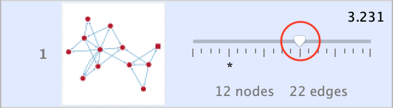
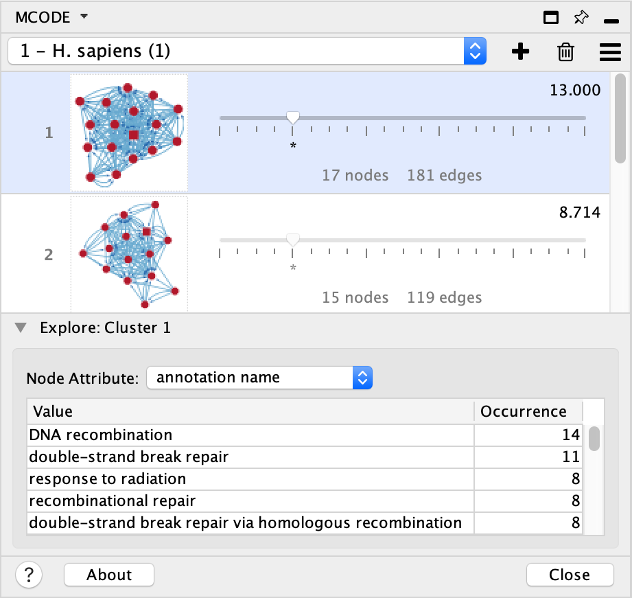

===============================
Exploring Results Interactively
===============================

In addition to fine-tuning a multitude of parameters to enhance the analysis process, MCODE provides a real-time cluster exploration feature.
This can be divided into two components: exploring cluster boundaries and exploring cluster content.

  - The first exploration allows you to expand or reduce the cluster based on the node score using the **Size Threshold** slider.
  - The second is the **Node Attribute Enumerator**, which provides a summary of the cluster's node attributes and their frequency in the cluster.

Together they can inform the user about the cluster's "natural" boundaries in the context of the network and ensure functional consistency.

These are both explained in greater detail below.

---------------------
Size Threshold Slider
---------------------

The slider scale ranges from **Min** to **Max** and has an 'origin' marker (^) for its starting position.
**Node Score Cutoff**, which is the most influential cluster size determinant is controlled by the slider.
As such, the initial position marker indicates the **Node Score Cutoff** value originally set in the :ref:`cluster-finding-params` section.

When moving the slider, the **Node Score Cutoff** is set to 0 at Min and 100 at Max,
however there are several notable differences between the functions of the **Size Threshold** slider and the **Node Score Cutoff** parameter (*Cluster Finding*):

  1. During exploration, the cluster is reevaluated without the requirements of satisfying the **K-Core** parameter.
     Thus, moving the slider leftwards of the initial position allows the cluster to be reduced to only the seed node.

  2. During exploration in the Max direction, the cluster is 'unaware' of other clusters.
     Unlike in the analysis where every subsequent attempt at finding a cluster is only allowed to expand around previously found clusters,
     the slider expands the cluster despite adjacent cluster borders.
     Thus, moving the slider rightwards of the initial position allows the cluster to be expanded to as much as the whole network.

     - However, the 'awareness' of other clusters is intact in the range between the 'origin' marker and Min to allow the cluster to return to its original size.

**Haircut** and **Fluff** are applied after slider movement if they were turned on in the original production of the result that is being explored.

In response to the slider, the **Cluster Browser** is updated with the new cluster's network graphic and details (number of nodes and edges and new cluster score).

  - The node selection in the main network view will also be updated.
  - Since clusters can expand to large and sometimes unreasonable sizes, the layouter may need extra time to complete its task.
    When this occurs, a loader and progress bar will appear in the **Cluster Browser**.
  - There is no need to wait for the cluster to be drawn, the details and node selections will remain responsive to the slider's movements.
  - If the new cluster exceeds 300 nodes, a place holder ("Too big to show") will be drawn instead since the graphic representation will take too long to compute
    and will likely be too crowded to be of any real value.

Several peculiarities may arise during size exploration:

  1. **Cluster Size Explosion**

    - When exploring a lower ranked cluster (further down the list) the cluster's size may depend heavily on nearby higher ranked clusters.
      This may not always occur since the finding process starts at the highest scoring nodes while clusters are ranked afterwards
      based on their size and connectivity -- higher scoring seed nodes may not produce higher scoring clusters.
      Given that, when expanding a cluster, there may be an unexpected initial discontinuity in size since the **Size Threshold** slider
      will ignore the presence of other clusters.
      If the cluster was produced around a low-scoring seed node then more nodes are likely to satisfy the **Node Score Cutoff** parameter.
      Such situations can indicate that the cluster in question may be part of a larger cluster.

  2. **Slider Dead-Zone**

    - Sometimes, on the other hand, moving the **Size Threshold** slider a long distance may produce no changes in cluster size.
      In such cases, the seed node's score is so high compared to its immediate neighbourhood that the **Node Score Cutoff**
      must be increased greatly to include much lower scoring members.
      This indicates that the cluster is more or less well separated from the surrounding network by a local peak in node scores and as such,
      it is likely a well defined cluster.

  3. **No Change**

    - Lastly, if no changes occur during size exploration, the cluster in question is likely not connected to the larger network and as such cannot expand.

-------------------------
Node Attribute Enumerator
-------------------------

The Enumerator provides a numerical summary of node attribute values possessed by the currently explored cluster's members.
It is meant to inform the user of the cluster's contents and aid in determining the cluster's functional relevance.
All node attributes that are available for the loaded network are listed in the select box.
When an attribute selection is made in one exploration, it persists for all cluster explorations within the given result.

The table below the select box has two columns:

  1. **Value**

    - This column lists all node attribute values that are possessed by the cluster being explored.
      With a simple string type attribute, such as **Node Status**, this list will never exceed
      the number of cluster members since every member can have only one value and some values may be shared by several members.
      However, list type attributes such as *Gene Ontology* (*GO*) terms may outnumber the cluster members since each member can have numerous values.

  2. **Occurrence**

    - This column simply displays the number of nodes possessing the particular attribute value listed in each row.
      The Enumerator table orders the list by the frequency in descending order where the most commonly occurring attribute value is listed on top.
    - The Occurrence numbers are best interpreted when compared with the number of nodes in the cluster.
      For example, when enumerating *Biological Process GO Terms*, it may be a good indicator that the given cluster is biologically relevant
      if 9 of the 10 cluster members share some specific value.

In combination with the **Size Threshold** slider, the Enumerator can be used to optimize clusters based on functional relevance.
As the slider is being manipulated, the enumerator will automatically report changes in cluster content for the selected attribute.
As such one can hone in on a size that, for example, reduces nodes with attribute values that are unrelated to some particular
value of interest which is simultaneously maximized.

.. note:: At this stage of MCODE development, the **Node Attribute Enumerator** is a precursor to more automated methods of accomplishing
          similar attribute-enhanced clustering and statistical reporting.
