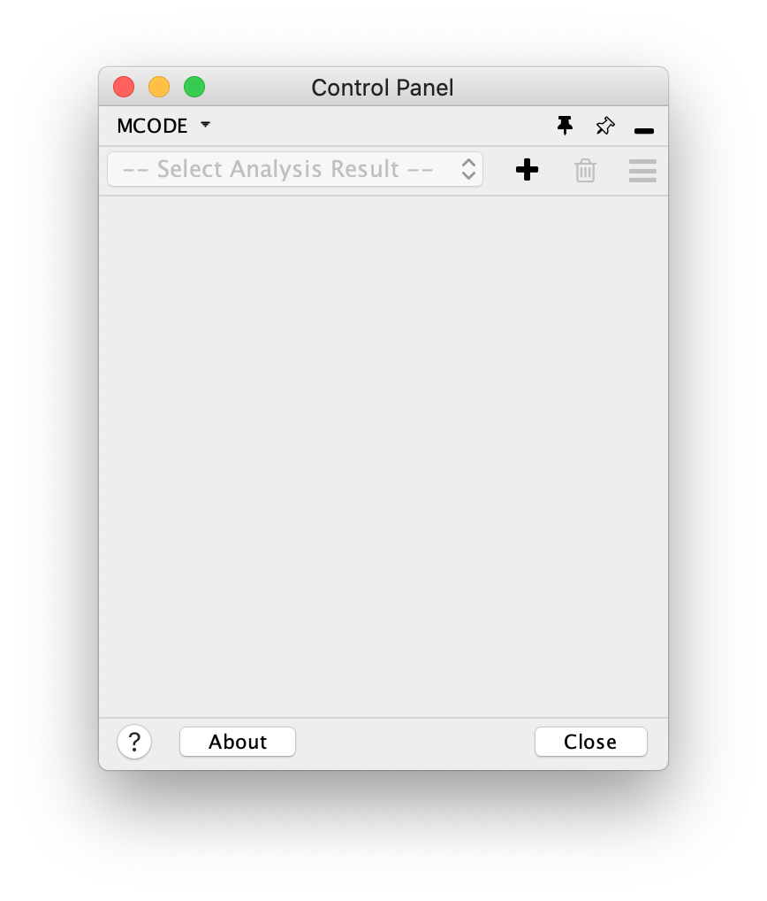

Getting and Interpreting Results
================================

MCODE Panel
-----------

The MCODE Panel is added to Cytoscape's **Control Panel** whenever the MCODE app is opened (menu option **Apps > MCODE**).

.. note:: The first time MCODE is opened after installing the app or starting Cytoscape,
          the MCODE Panel may not appear right away, because the New Analysis dialog will pop up automatically instead.
          This happens only if there is a selected network in the current Cytoscape session,
          but the MCODE Panel will then show up right after the New Analysis dialog is closed.

The MCODE Panel contains three main sections: the toolbar, the results panel and a footer, as described below.

Toolbar
-------

Results
-------

Footer
------
