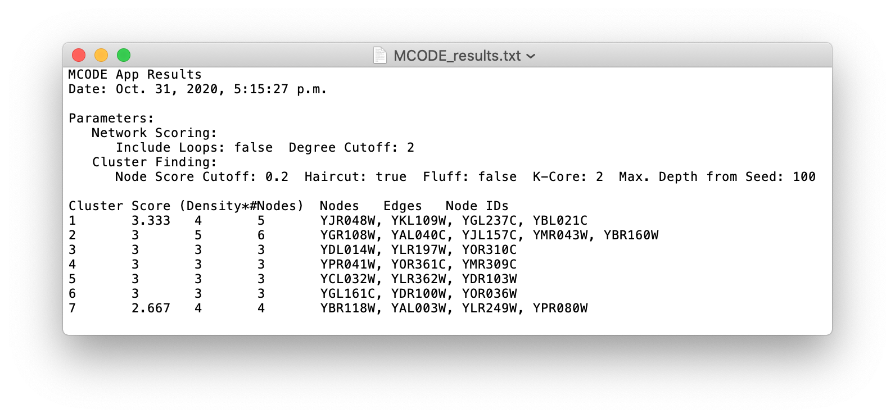

==================
Outputting Results
==================

------------------
Create Sub-Network
------------------

Clusters can be output as sub or child-networks of the original network by selecting the
**Create Cluster Network** option located on the MCODE menu which appears after clicking the :ref:`toolbar`'s **Options** button.

  - Since exploration allows for a cluster size to change, the user can create as many sub-networks of the same cluster as desired.
  - New networks are named by their *result number*, *cluster rank* and *score* (e.g. ``1: Cluster 2 (Score: 4.3)``).

--------------
Export as Text
--------------

MCODE results can be exported to a time-stamped text file by selecting the **Export Result** option
located on the MCODE **Options** menu (see :ref:`toolbar` section).

**Clusters** are summarized in a tab-delimited format consisting of:

  - ``Cluster``: rank
  - ``Score (Density*#Nodes)``: cluster score (density multiplied by the number of members)
  - ``Nodes``: number of nodes
  - ``Edges``: number of edges
  - ``Node IDs``: cluster member IDs (comma-delimited)

The **parameters** used in scoring and finding the exported result are included in the file as well for future reference:

  - ``Network Scoring``:

    - ``Include Loops``
    - ``Degree Cutoff``
    - ``K-Core``

  - ``Cluster Finding``:

    - ``Node Score Cutoff``
    - ``Haircut``
    - ``Fluff``
    - ``K-Core``
    - ``Max. Depth from Seed``
