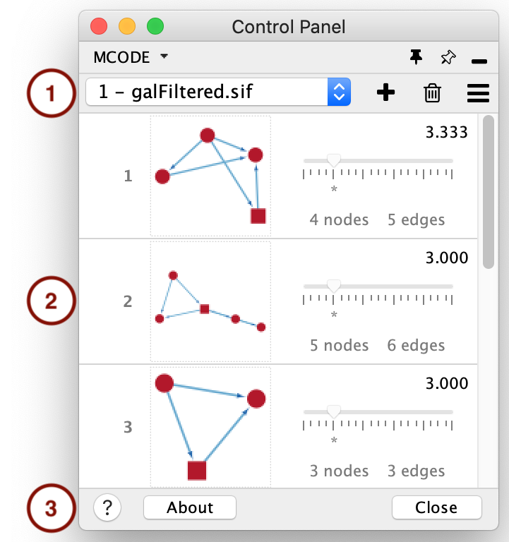
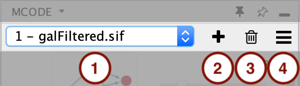
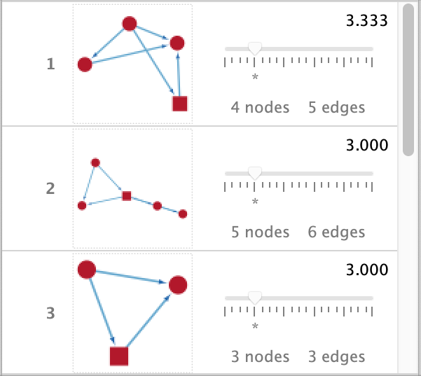

==================
The User Interface
==================

-----------
MCODE Panel
-----------

The MCODE Panel is added to Cytoscape's **Control Panel** whenever the MCODE app is opened (menu option **Apps > MCODE**),
and it contains three main sections:

  1. Toolbar
  2. Cluster Browser
  3. Footer

.. note:: The first time MCODE is opened after installing the app or starting Cytoscape,
          the *MCODE Panel* may not appear right away, because the *New Analysis Dialog* will pop up automatically instead.
          This happens only if the current Cytoscape session has at least one network and it is selected.
          Either way, the *MCODE Panel* will show up right after the *New Analysis Dialog* is closed.

.. _toolbar:

Toolbar
-------

Use the toolbar components to add and manage your analysis results:

1. **Results**:

   Selector that lists all your MCODE results and allows you to switch between them.

2. **New Analysis**:

   Click this button whenever you want to perform a new analysis. It is disabled when no network is selected.

3. **Discard Selected Result**:

   Click this button to permanently remove the selected result.

4. **Options**:

   Menu that provides additional options, such as exporting the results and creating a network from the selected cluster.

   .. figure:: images/options_menu.png
      :width: 75%
      :align: center

Cluster Browser
---------------

This section lists the clusters which were found for the selected result.

Footer
------

1. **Online Help**: Opens this documentation.
2. **About**: Opens MCODE's *About Dialog*.
3. **Close**: Disposes all the MCODE results and closes the *MCODE Panel*.
